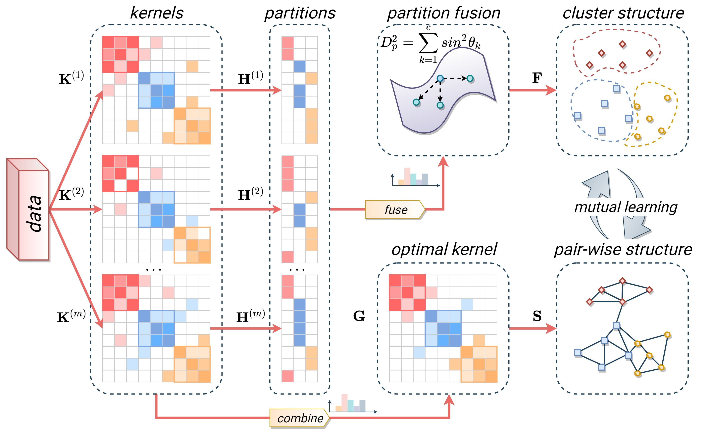

# 
`Mutual Structure Learning for Multiple Kernel Clustering (Information Science 2023)`

> **Authors:**
Zhenglai Li, Chang Tang, Xiao Zheng, Zhiguo Wan, Kun Sun, Wei Zhang, Xinzhong Zhu

This repository contains simple Matlab implementation of our paper [MSL-MKC](https://www.sciencedirect.com/science/article/pii/S0020025523010307).

### 1. Overview

      

Illustration of the proposed multiple kernel clustering method. Each base partition is obtained by performing kernel $k$-means clustering on each base kernel. The consensus partition, optimal kernel matrix, and adaptive neighbor graph are denoted by $\mathbf{F}$, $\mathbf{G}$, and $\mathbf{S}$, respectively. The method integrates optimal kernel learning, partition fusion, and adaptive neighbor graph learning into a unified framework, allowing for mutual enhancement of the cluster structure and pair-wise structure. As a result, the proposed method can effectively learn an improved consensus partition matrix for the multiple kernel clustering task.  

### 2. Citation

Please cite our paper if you find the work useful:

    @article{Li_2023_MSL-MKC,
        title={Mutual structure learning for multiple kernel clustering},
        author={Li, Zhenglai and Tang, Chang and Zheng, Xiao and Wan, Zhiguo and Sun, Kun and Zhang, Wei and Zhu, Xinzhong},
        journal={Information Sciences},
        volume={647},
        pages={119445},
        year={2023},
        publisher={Elsevier}
        }